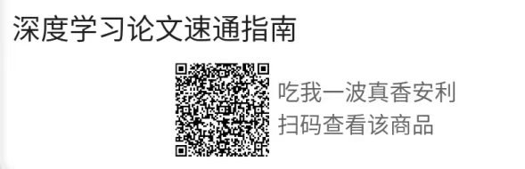

全网最全最新的即插即用模块：目前进度70％
包括卷积 注意力机制 下采样 特征融合模块等
持续更新~
详细论文讲解关注公众号【ai缝合大王】和B站【ai缝合大王】
模块分享、缝合交流进q群：
994264161
更多细分方向群：① 目标检测 ② 图像分类 ③ 语义分割 ④ 人脸识别 ⑤ 三维重建 ⑥ 多模态融合 ⑦ 姿态估计 ⑧ 超分辨率⑨ 自动驾驶 ⑩ 图像生成 ⑪ 遥感影像 ⑫ 医学图像 ⑬ 底层视觉 ⑭ YOLO 系列 ⑮ Mamba 等新架构⑯ 视频处理 ⑰ 3D ⑱ 大模型 ⑲ 重识别（ReID）⑳ 图像去雨/去噪/去模糊
细分方向群为微信群，扫描二维码添加微信，扣1-20拉你进群。

目前主要更新二维图像模块，所有二维图像都可以用，图像分类、分割、目标检测、超分辨率重建、图像去雾、暗光增强等所有图像任务都可以用   3d模块 和1d模块 后续会陆续更新。

这里我介绍一下，加入深度学习论文指南:
第一，如果你是新手小白，代码论文都看不懂，我们会给出最优的学习路线，让你少走弯路，节省很多时间。

第二，这里提供缝合模块的技巧，让你轻松使用github上的模块即插即用，插入自己的模型中涨点。

第三，如果你缝合了很多模块发现没有效果，不妨来这里看看，这里提供了高阶缝合技巧，结构缝合，串并联交互缝合，创新点缝合等，并且还有自制即插即用模块分享。

第四，如果缝合好模块之后，不知道怎么编故事，怎么写论文的思路，这里也会进行提供。

第五，每个成员都可以发布主题，我们也会针对主题进行提问，随着人数的增多，你想知道的任何这方面的问题几乎都有模板答案。

第六，这是一个长期项目，不是说就几个视频加pdf，是一年的时间内所有内容。

